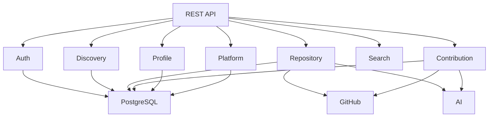

# Application Architecture

## Document Information

| Field   | Value                    |
| ------- | ------------------------ |
| Version | 1.0                      |
| Status  | Approved                 |
| Layer   | Application Architecture |

---

# Purpose

The Application Architecture defines how StackAudit is organized internally as software.

Unlike Business Architecture, which focuses on business capabilities, this document defines software modules, their responsibilities, and their interactions.

StackAudit adopts a **Modular Monolith** architecture. Each module owns its business logic, communicates through well-defined interfaces, and can evolve independently.

---

# Architectural Style

**Architecture Pattern:** Modular Monolith

### Why Modular Monolith?

* Simple deployment
* Faster development
* Clear module boundaries
* Easier debugging
* Future migration to microservices if required

---

# Application Modules

---

# Module Responsibilities

## Authentication Module

Responsibilities

* Login
* Registration
* GitHub OAuth
* JWT
* Authorization
* Session Management

Owns

* Users
* Authentication
* Permissions

---

## Repository Discovery Module

Responsibilities

* Search repositories
* Ranking
* Filtering
* Trending repositories

Owns

* Search logic
* Recommendation queries

---

## Repository Analysis Module

Responsibilities

* Repository Health Score
* Documentation Analysis
* Technology Detection
* Repository Summary
* Engineering Metrics

Owns

* Repository Intelligence

---

## Contribution Guidance Module

Responsibilities

* Good First Issues
* PR Acceptance Rate
* Contribution Difficulty
* Repository Readiness
* Maintainer Activity

---

## Developer Profile Module

Responsibilities

* User Profile
* Saved Repositories
* Preferences
* Contribution History
* Learning Progress

---

## Platform Module

Responsibilities

* Notifications
* Subscription Management
* Feature Access Control
* Billing (Future)
* Audit Logs
* Administration

---

# Module Communication Principles

* Modules communicate through interfaces, not direct database access.
* No module owns another module's business logic.
* Shared utilities remain stateless.
* External services are accessed through adapter layers.

---

# External Integrations

* GitHub API
* AI Provider
* Email Service

These integrations are isolated behind service adapters to avoid vendor lock-in.

---

# Architectural Decisions

* Modular Monolith over Microservices
* Domain ownership per module
* Provider abstraction for external services
* Shared infrastructure with isolated business logic

---

# Related ADRs

* ADR-001: Modular Monolith
* ADR-003: GitHub Integration Layer
* ADR-006: AI Provider Abstraction

---

# Review Summary

The Application Architecture establishes the internal software boundaries of StackAudit. Every backend package, API endpoint, database schema, and future service will map to one or more application modules defined in this document.
