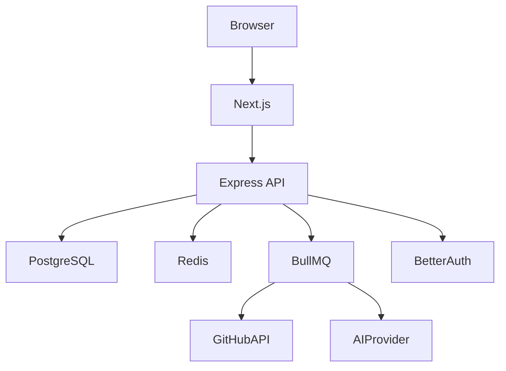

# Technology Architecture

## Document Information

| Field   | Value                   |
| ------- | ----------------------- |
| Version | 1.0                     |
| Status  | Approved                |
| Layer   | Technology Architecture |

---

# Purpose

The Technology Architecture defines the technology stack used to implement StackAudit and provides the rationale behind each major technology choice.

Technology decisions are driven by business requirements, engineering constraints, maintainability, and scalability.

---

# Technology Stack

| Layer            | Technology               | Purpose                                       |
| ---------------- | ------------------------ | --------------------------------------------- |
| Frontend         | Next.js                  | React framework with App Router and SSR       |
| UI               | Tailwind CSS + shadcn/ui | Modern, accessible UI components              |
| Backend          | Node.js + Express        | REST APIs and business logic                  |
| Language         | TypeScript               | Type safety and maintainability               |
| Database         | PostgreSQL               | Primary relational database                   |
| ORM              | Prisma                   | Database access and migrations                |
| Cache            | Redis                    | Session storage and caching                   |
| Queue            | BullMQ                   | Background repository analysis                |
| Authentication   | Better Auth              | GitHub OAuth and authentication               |
| AI               | OpenAI / Gemini          | Repository summaries and engineering insights |
| CI/CD            | GitHub Actions           | Automated testing and deployment              |
| Containerization | Docker                   | Consistent runtime environment                |
| Logging          | Pino                     | Structured logging                            |
| Monitoring       | OpenTelemetry (Future)   | Metrics and tracing                           |

---

# Technology Architecture

---

# Technology Selection Principles

## Stability over Trend

Choose mature technologies with strong ecosystems and community support.

---

## Developer Experience

Prioritize tools that improve maintainability, debugging, and onboarding.

---

## Scalability

Select technologies that support future growth without introducing unnecessary complexity during the MVP stage.

---

## Replaceability

External services such as GitHub APIs and AI providers should be abstracted behind interfaces.

---

## Cost Efficiency

Technology choices should minimize operational costs while supporting future scaling.

---

# Deferred Technologies

The following technologies are intentionally postponed:

* Kubernetes
* Elasticsearch
* Kafka
* Microservices
* Vector Databases
* Multi-region Deployment

These will be evaluated when justified by product growth.

---

# Key Technology Decisions

### PostgreSQL

Chosen for relational consistency, indexing, and mature tooling.

### Redis

Used for caching, sessions, and temporary application state.

### BullMQ

Processes long-running jobs such as repository analysis asynchronously.

### Better Auth

Provides secure authentication with GitHub OAuth support.

### Docker

Ensures reproducible development and deployment environments.

---

# Related ADRs

* ADR-001: Modular Monolith
* ADR-002: PostgreSQL
* ADR-004: Redis Caching
* ADR-005: BullMQ
* ADR-006: AI Provider Abstraction

---

# Review Summary

The Technology Architecture defines the implementation technologies for StackAudit while ensuring that every technology choice aligns with business goals, architectural principles, and long-term maintainability. Technologies may evolve over time, but changes should be documented through Architecture Decision Records (ADRs) to preserve traceability.
