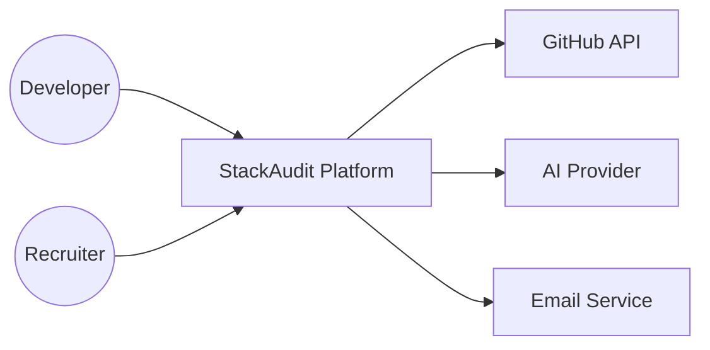

# Context Diagram

## Purpose

The Context Diagram provides a high-level view of StackAudit and its interactions with external actors and systems. It defines system boundaries and identifies dependencies without exposing internal implementation details.

## External Actors

* Developer
* Recruiter
* GitHub API
* AI Provider (OpenAI/Gemini)
* Email Provider

## Context Diagram

## Responsibilities

* Developers interact with repository intelligence features.
* Recruiters consume portfolio intelligence.
* GitHub provides repository data.
* AI Provider generates engineering insights.
* Email Provider handles notifications.

## Review

Status: Approved
Version: 1.0
