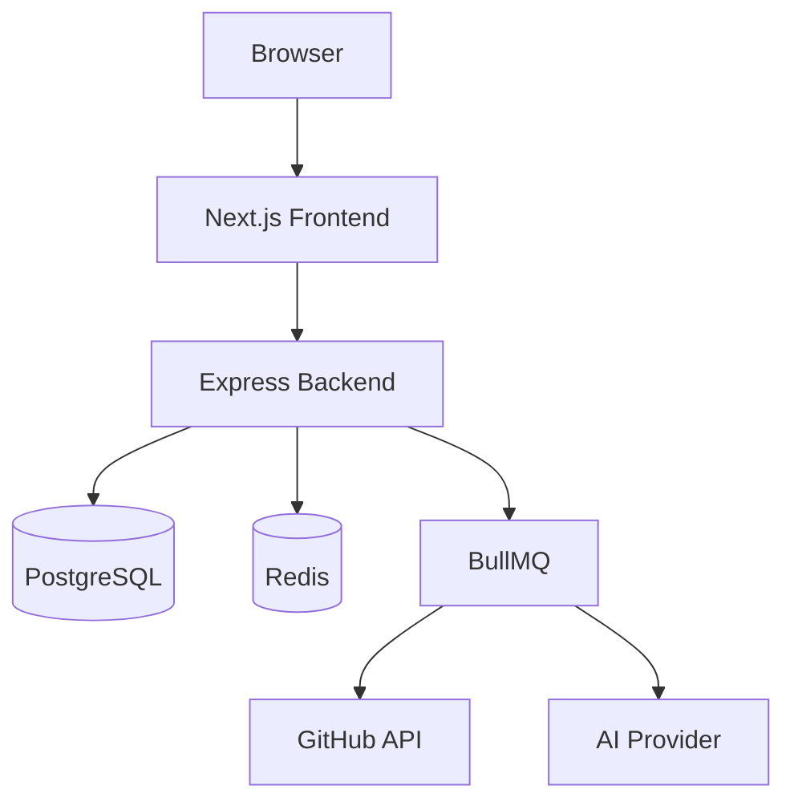

# Container Diagram

## Purpose

Defines the major deployable applications and infrastructure components.

## Containers

| Container   | Responsibility             |
| ----------- | -------------------------- |
| Frontend    | User Interface             |
| Backend     | Business Logic             |
| PostgreSQL  | Persistent Storage         |
| Redis       | Cache & Sessions           |
| BullMQ      | Background Jobs            |
| GitHub      | External Repository Source |
| AI Provider | Repository Intelligence    |
