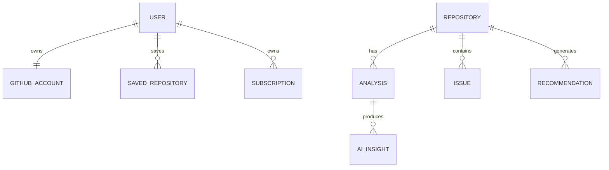

# Domain Model

```mermaid
erDiagram

USER ||--|| GITHUB_ACCOUNT : owns
USER ||--o{ SAVED_REPOSITORY : saves

REPOSITORY ||--o{ ANALYSIS : has

REPOSITORY ||--o{ ISSUE : contains

REPOSITORY ||--o{ RECOMMENDATION : generates

USER ||--o{ SUBSCRIPTION : owns

ANALYSIS ||--o{ AI_INSIGHT : produces
```

## Core Entities

- User
- GitHubAccount
- Repository
- Analysis
- AIInsight
- Issue
- Recommendation
- Subscription