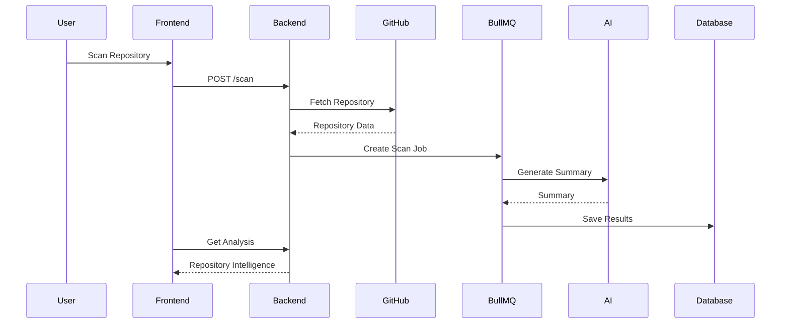

# Repository Scan Flow

```mermaid
sequenceDiagram

User->>Frontend: Scan Repository

Frontend->>Backend: POST /scan

Backend->>GitHub: Fetch Repository

GitHub-->>Backend: Repository Data

Backend->>BullMQ: Create Scan Job

BullMQ->>AI: Generate Summary

AI-->>BullMQ: Summary

BullMQ->>Database: Save Results

Frontend->>Backend: Get Analysis

Backend-->>Frontend: Repository Intelligence
```