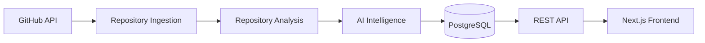

```mermaid
flowchart LR

GitHub["GitHub API"]

Ingestion["Repository Ingestion"]

Analysis["Repository Analysis"]

AI["AI Intelligence"]

Storage[("PostgreSQL")]

API["REST API"]

Frontend["Next.js Frontend"]

GitHub --> Ingestion
Ingestion --> Analysis
Analysis --> AI
AI --> Storage
Storage --> API
API --> Frontend
```

## Pipeline

1. Fetch Repository
2. Analyze Repository
3. Generate Intelligence
4. Persist Analysis
5. Serve Results